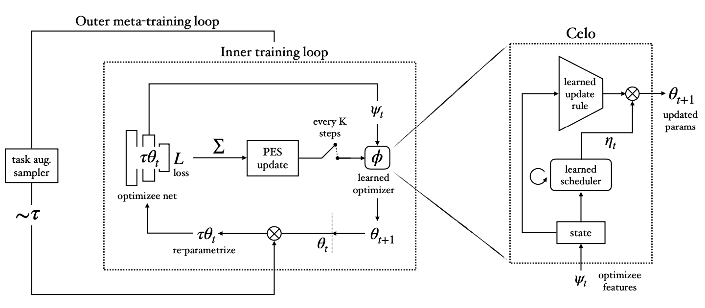

# Celo: Training Versatile Learned Optimizers on a Compute Diet

<a href="https://github.com/psf/black"></a>

JAX implementation of our paper [Celo: Training Versatile Learned Optimizers on a Compute Diet](https://arxiv.org/abs/2501.12670):
```
@article{moudgil2025learning,
  title={Learning Versatile Optimizers on a Compute Diet},
  author={Moudgil, Abhinav and Knyazev, Boris and Lajoie, Guillaume and Belilovsky, Eugene},
  journal={arXiv preprint arXiv:2501.12670},
  year={2025}
}
```

We open-source all the pretrained optimizers including baselines along with meta-training and evaluation scripts. We also provide scripts to test learned optimizers on MLCommons [AlgoPerf](algoperf/) benchmark.

## Overview

We propose Celo, a **c**ompute-**e**fficient **l**earned **o**ptimizer, which meta-generalizes and scales better than prior learned optimizer approaches with a given meta-training compute budget. Celo design is much simpler than previous learned optimizers and consists of mainly two modules: (1) learned MLP update rule (2) learned scheduler. These two modules are learned in a decoupled two-phase meta-training procedure with task augmentation using Persistent Evolutionary Strategies (PES):



We evaluate Celo meta-generalization capabilities on a set of 17 diverse evaluation tasks from [VeLOdrome benchmark](https://arxiv.org/abs/2211.09760) including convnets, transformer language modeling, ViTs, autoencoders, etc and also compare with 
15 tuned optimizers on these tasks including Adam, Shampoo, etc. We refer the reader to our [paper](https://arxiv.org/abs/2501.12670) for more details.

## Setup

First, setup `learned_optimization` repo along with its dependencies by following the instructions [here](https://github.com/amoudgl/learned_optimization?tab=readme-ov-file#update).

Then, install `celo` package:
```
git clone git@github.com:amoudgl/celo.git
cd celo
pip install -e .
```

## Usage

All the optimizers implemented in this repo follow optax-style functional syntax which
takes state containing params as input and return updated state with updated params:
```python
opt = Adam(...)

# init method initializes all internal buffers such as momentum, second-moment, etc
# using model param shapes and returns an optimizer state containing model params
# NOTE: learned optimizers may require more inputs such as number of steps
opt_state = opt.init(params=model_params, num_steps=num_steps)

# in training step, update method takes grad as input along with previous state
# and return next state
# NOTE: learned optimizers may take additional input at each step such as loss
opt_state = opt.update(opt_state, grad=grad, loss=loss)
```

Check out the base class [here](https://github.com/google/learned_optimization/blob/48410b5d665200f46f0365940b7a9bc0b7dfe07a/learned_optimization/optimizers/optax_opts.py#L46-L81) for more details on the init and update method arguments, which are consistently followed by all optimizers implemented in this repository.

### Download

Trained checkpoints for Celo and all the learned optimizer baselines are available on HuggingFace for download:

| Optimizer | HuggingFace | Download command
| -------- | ------- | ------- |
| celo | [repo](https://huggingface.co/amoudgl/celo) | `huggingface-cli download amoudgl/celo --local-dir ./`
| celo-adam | [repo](https://huggingface.co/amoudgl/celo-adam) | `huggingface-cli download amoudgl/celo-adam --local-dir ./`
| rnn-mlp-lopt | [repo](https://huggingface.co/amoudgl/rnn-mlp-lopt) | `huggingface-cli download amoudgl/rnn-mlp-lopt --local-dir ./`
| adafac-mlp-lopt | [repo](https://huggingface.co/amoudgl/adafac-mlp-lopt) | `huggingface-cli download amoudgl/adafac-mlp-lopt --local-dir ./`
| velo-s | [repo](https://huggingface.co/amoudgl/velo-s) | `huggingface-cli download amoudgl/velo-s --local-dir ./`
| velo-4000 | [repo](https://huggingface.co/amoudgl/velo-4000) | `huggingface-cli download amoudgl/velo-4000 --local-dir ./`

All the above learned optimizers except velo-4000 are meta-trained on a set of 4 image classification MLP tasks with task augmentation. We show that Celo meta-generalizes well beyond its meta-training distribution, and its performance on harder/larger tasks scales better than the baselines as the meta-training budget is increased. Hence our proposed recipe is scalable but the pretrained optimizers released above are mainly for research purposes and do not scale to every large-scale task as per our preliminary [testing](algoperf/README.md#preliminary-results) on AlgoPerf (likely due to limited meta-training). Please refer to our [paper](https://arxiv.org/abs/2501.12670) for more details. `velo-4000` is a pretrained optimizer [released](https://arxiv.org/abs/2211.09760) by Google. It was meta-trained with large-scale compute, 4000 TPU months, on a mixture of tasks. We simply provide the released checkpoint in a format compatible with our repo.

HuggingFace Python API can also be used to download checkpoints like below:
```python
from huggingface_hub import hf_hub_download
hf_hub_download(repo_id="amoudgl/celo", local_dir="./")
```

To setup hugging CLI for download via command line, refer to [this page](https://huggingface.co/docs/huggingface_hub/en/guides/cli).

### Loading pretrained optimizer

To load learned optimizer params from a checkpoint path, use `init_lopt_from_ckpt` method:
```python
from celo.utils import init_lopt_from_ckpt

path = 'path/to/pretrained/checkpoint/theta.state'
celo = get_optimizer('celo')
opt = init_lopt_from_ckpt(celo, path)  # ready-to-use learned optimizer!

# use like a standard optimizer as described above
opt_state = opt.init(...)
```

### Example script

Following is a simple training script that trains an MLP on MNIST task using pretrained Celo optimizer:
```python
import jax
from celo.factory import get_optimizer
from learned_optimization.tasks.fixed.image_mlp import ImageMLP_FashionMnist_Relu128x128
from huggingface_hub import hf_hub_download
from celo.utils import init_lopt_from_ckpt
key = jax.random.PRNGKey(7)

# initialize task
task = ImageMLP_FashionMnist_Relu128x128()  # simple example task from learned_optimization
key, key1 = jax.random.split(key)
params, state = task.init_with_state(key1)

# load pretrained optimizer
hf_hub_download(repo_id="amoudgl/celo", filename="theta.state", local_dir="./")
celo = get_optimizer('celo')
opt = init_lopt_from_ckpt(celo, "theta.state")

# initialize optimizer state
num_steps = 1000
opt_state = opt.init(params, model_state=state, num_steps=num_steps)

# training loop
for i in range(num_steps):
    # forward + backward pass
    batch = next(task.datasets.train)
    key, key1 = jax.random.split(key)
    params = opt.get_params(opt_state)
    loss, grad = jax.value_and_grad(task.loss)(params, key1, batch)

    # optimizer step
    opt_state = opt.update(opt_state, grad, loss=loss)

    # log
    if i % 50 == 0:
        print(f'[step {i}] loss: ', loss)
```

Checkout test script `celo/test.py` to evaluate any optimizer on all the tasks considered in our work.

## Meta-training

To do phase 1 meta-training of Celo (only meta-train MLP update rule) with task augmentation, do:
```
python -m celo.train --optimizer celo_phase1 --train_partial --outer_iterations 100000 --max_unroll_length 2000 --seed 0 --trainer pes --name train_celo_phase1 --outer_lr 3e-4
```

To continue phase 2 meta-training of Celo (meta-train scheduler with frozen MLP update) from phase 1 checkpoint, do:
```
python -m celo.train --optimizer celo --train_partial --init_from_ckpt ./train_celo_phase1/theta.state --outer_iterations 100000 --max_unroll_length 2000 --seed 0 --name celo_phase2 --task fast_velo --outer_lr 3e-4 --aug reparam --aug_reparam_level global --name train_celo_phase2
```

To meta-train any other learned optimizer (say, RNN with MLP update rule) without two-stage training with task augmentation, simply skip `--train_partial` flag:
```
python -m celo.train --optimizer rnn_mlp --outer_iterations 100000 --max_unroll_length 2000 --seed 0 --task fast_velo --outer_lr 1e-4 --trainer pes --aug reparam --aug_reparam_level global --name train_rnn
```

To meta-train without task augmentation, skip `--aug` flag which is set to `None` by default.

Key flags:
- `--optimizer celo_phase1` -- uses only MLP update rule for parameter update without any scheduler
- `--optimizer celo` -- does full celo update using both MLP update rule and learned scheduler
- `--train_partial` -- meta-trains with some optimizer params frozen, frozen params are returned by the specified optimizer
- `--task` -- meta-training task, we use `fast_velo` which contains a set of 4 small MLP tasks from velo paper
- `--trainer` -- outer trainer for meta-gradient estimation (we use PES)
- `--outer_iterations` -- total number of meta-iterations i.e. outer updates to optimizer
- `--max_unroll_length` -- maximum rollout length during meta-training
- `--init_from_ckpt` -- if specified, optimizer params are loaded from this checkpoint in meta-training instead of random initialization
- `--aug` -- if specified, task augmentation via reparametrization will be used

Checkout all meta-training flags along with their descriptions in `celo/train.py`.


## Acknowledgements

Huge thanks to the teams behind [google/learned_optimization](https://github.com/google/learned_optimization) for open-sourcing their work -- this project wouldn't have been possible without it. We’d also like to acknowledge the neat evaluation library [google-research/rliable](https://github.com/google-research/rliable), which we used to compute IQM metrics.

## License

This project is released under the MIT License. However, some source files are adapted from
[google/learned_optimization](https://github.com/google/learned_optimization) repository and are licensed under the Apache License 2.0. 
These files are located in `celo/` directory and retain their original license.
